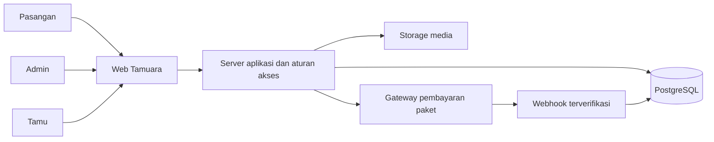

# Rencana Pengembangan Tamuara

**Tagline:** Kisah kalian, dirayakan bersama.  
**Tanggal:** 24 September 2026  
**Status:** Rancangan pengembangan v1, untuk menjadi acuan desain dan implementasi.

## 1. Arah produk dan keputusan

Tamuara adalah web app undangan pernikahan untuk banyak pasangan. Setiap pasangan mendapatkan website undangan, editor, daftar tamu, dan rekap kehadiran sendiri dalam satu platform.

| Sudah diputuskan pengguna | Implikasi pengembangan |
| --- | --- |
| Nama Tamuara dan tagline di atas | Menjadi identitas website pemasaran dan dashboard |
| Logo amplop, hati, dan pesawat kertas yang dipilih | Aset acuan: `brand/tamuara-logo.png` |
| Platform digunakan banyak pasangan | Pemisahan data dan hak akses dibangun sejak awal |
| Layanan gabungan: mandiri atau dibantu admin | Pasangan dan admin pendamping menggunakan editor yang sama, dengan hak akses berbeda |
| Menyusun rencana pengembangan | Dokumen ini belum merupakan implementasi aplikasi |

**Usulan dalam dokumen ini:** tiga tema saat pilot, target katalog delapan tema, pembayaran per website undangan, cakupan MVP, stack, harga percobaan, masa aktif, dan estimasi waktu. Hal-hal tersebut belum menjadi keputusan final pengguna.

**Hasil yang ingin dicapai:** pasangan dapat membuat, memeriksa, membayar, menerbitkan, dan membagikan undangan; tamu dapat membaca dan merespons; tim Tamuara dapat membantu tanpa meminta kata sandi pelanggan.

## 2. Model layanan dan monetisasi

### Unit yang dijual

Usulan: satu pembelian untuk **satu website undangan pernikahan**, yang dapat berisi akad/pemberkatan dan resepsi serta banyak tautan tamu.

Contoh URL, memakai domain ilustrasi:

- Website utama: `tamuara.example/u/ayu-dan-bima`.
- Tautan tamu: `tamuara.example/u/ayu-dan-bima?guest=TOKEN_ACAK`.
- Tautan tamu lain tetap bagian dari website dan pembelian yang sama.

Harga tidak dihitung per tautan yang dibagikan. Kuota tamu, foto, masa aktif, dan bantuan admin dapat dibedakan per paket dan harus terlihat sebelum checkout. Nama domain produksi belum ditetapkan.

### Paket untuk diuji

| Paket usulan | Nilai utama | Hipotesis harga sekali bayar |
| --- | --- | --- |
| Mandiri | Tema siap pakai, editor, tamu, RSVP, ucapan, amplop digital | Rp199.000–Rp299.000 |
| Dibantu Admin | Fitur Mandiri, pengisian dan penataan oleh tim, pemeriksaan bersama | Rp499.000–Rp799.000 |
| Desain Khusus, tahap berikutnya | Desain dan pekerjaan sesuai brief yang disepakati | Mulai Rp1.000.000; penawaran sesuai lingkup |

Angka ini adalah **harga percobaan internal**, bukan klaim harga pasar atau harga resmi. Harga akhir dipilih setelah menghitung biaya dan menguji kesediaan pelanggan membayar.

Usulan awal masa aktif: sampai 12 bulan setelah tanggal acara utama yang disepakati saat pembelian. Simpan tanggal kedaluwarsa yang pasti di pesanan; perubahan tanggal acara tidak otomatis memperpanjang layanan. Usulan bantuan admin mencakup dua putaran revisi dalam lingkup paket. Masa aktif draf yang belum dibeli, batas media, kuota tamu, kebijakan pembatalan, serta waktu pengerjaan perlu ditetapkan sebelum paket dijual.

Ukuran usaha yang dicatat:

`Kontribusi per pesanan = pendapatan bersih pesanan − biaya pembayaran − alokasi hosting/media − waktu kerja admin − biaya akuisisi/komisi`.

Pisahkan biaya pengembangan awal, operasional bulanan, dan biaya per pesanan. Jangan menentukan harga hanya dari biaya hosting. Sumber pendapatan lanjutan: tambahan layanan admin, perpanjangan, desain khusus, dan kerja sama wedding organizer.

### Pembayaran paket dan amplop digital

| Aliran | Pengirim dan penerima | Peran Tamuara |
| --- | --- | --- |
| Pembelian paket | Pasangan → merchant Tamuara | Mencatat pesanan, pembayaran, dan hak penggunaan |
| Amplop digital | Tamu → rekening/metode penerimaan pasangan | Menampilkan informasi dan tombol salin/QR milik pasangan |

MVP memakai transfer hadiah langsung ke pasangan. Tamuara tidak menyimpan saldo hadiah. Klik salin nomor atau membuka QR tidak dianggap bukti transfer berhasil. Nominal hadiah dan konfirmasi otomatis tidak termasuk MVP.

## 3. Perjalanan pengguna

### Pasangan yang mengisi sendiri

1. Melihat landing page, tema, demo, dan isi paket.
2. Membuat akun dan memilih tema; mulai draf tanpa harus langsung membayar.
3. Mengisi profil pasangan, acara, foto, cerita opsional, dan informasi hadiah.
4. Memeriksa pratinjau privat dan mencoba tampilan ponsel.
5. Membayar paket; sistem mengaktifkan hak publikasi setelah pembayaran terverifikasi.
6. Memeriksa ringkasan final lalu menekan **Terbitkan undangan**.
7. Menambahkan/mengimpor tamu, menetapkan kuota, dan membagikan tautan pribadi.
8. Memantau RSVP, mengelola ucapan, serta memperbarui konten bila perlu.
9. Mengekspor data sebelum masa aktif berakhir; arsip dan penghapusan mengikuti kebijakan retensi.

### Pasangan yang dibantu admin

1. Memilih paket bantuan, membuat akun, dan mengirim brief serta materi.
2. Membayar paket bantuan; pekerjaan masuk antrean penugasan.
3. Admin yang ditugaskan mengisi draf melalui editor yang sama.
4. Pasangan menerima pratinjau, memeriksa isi, dan mengirim revisi terstruktur.
5. Pasangan menyetujui versi final dan menerbitkan undangan dari akunnya.
6. Admin membantu pengelolaan sesuai paket; pasangan tetap dapat mengakses dashboard.

Pasangan dapat meminta peningkatan dari Mandiri ke Dibantu Admin. Harga peningkatan dihitung dari aturan paket, disimpan sebagai pesanan tersendiri, dan tidak menghapus pekerjaan sebelumnya. Formulir mencatat siapa yang terakhir mengubah data; konflik penyuntingan tidak boleh menimpa perubahan orang lain secara diam-diam.

### Tamu

Membuka tautan → membuka sampul → membaca acara dan lokasi → mengisi RSVP untuk acara yang diizinkan → menulis ucapan → melihat informasi hadiah bila diaktifkan.

Tamu tidak perlu membuat akun. Tautan berisi token memberikan akses terbatas kepada penerima undangan tersebut; tautan yang diteruskan tidak membuktikan identitas orang yang membukanya.

## 4. Pengguna dan hak akses

| Pengguna | Hak utama |
| --- | --- |
| Pengunjung | Melihat informasi produk, katalog, demo, dan harga |
| Pasangan/pemilik | Mengelola isi, tamu, RSVP, ucapan, rekening hadiah, pembayaran, dan publikasi undangannya |
| Admin pendamping | Mengelola draf dan bantuan pada undangan yang ditugaskan; tidak menerbitkan tanpa tindakan pemilik |
| Pengelola platform | Mengatur paket, tema aktif, pesanan, penugasan, dan dukungan; tindakan sensitif dicatat |
| Tamu | Membaca versi terbit dan mengubah RSVP miliknya sesuai token dan kuota |

Satu akun dapat mempunyai beberapa undangan. Struktur membership mendukung penugasan admin sejak MVP; fitur mengundang akun pasangan kedua dapat ditambahkan kemudian. Kontrol akses diterapkan di server dan database, bukan hanya dengan menyembunyikan menu.

## 5. Ruang lingkup versi pertama

| Area | Fitur MVP dan hasil yang harus tersedia |
| --- | --- |
| Website pemasaran | Landing page, katalog, demo dengan data contoh, rincian paket, FAQ, kontak, ketentuan, dan privasi |
| Akun | Daftar/login, pemulihan akses, profil, daftar undangan milik pengguna |
| Editor | Langkah pengisian, simpan draf, indikator kelengkapan, urutan bagian terkontrol, pratinjau ponsel |
| Isi undangan | Sampul, nama pasangan, orang tua opsional, pembuka, acara, lokasi/peta, galeri, cerita opsional, penutup |
| Pengalaman undangan | Hitung mundur, simpan tanggal, tombol peta, musik opsional setelah interaksi, tampil baik di ponsel |
| Tema | Tiga tema matang saat pilot, pilihan warna/font yang dikurasi, ganti tema tanpa mengisi ulang |
| Publikasi | Slug unik, pratinjau privat, validasi kelengkapan, publikasi dan pembaruan eksplisit, nonaktifkan/arsip |
| Tamu | Input manual, impor CSV dengan pratinjau, kelompok, kuota orang, akses acara, token per penerima |
| Distribusi | Susun teks undangan, salin tautan/pesan, buka WhatsApp untuk dikirim pengguna |
| RSVP | Hadir/tidak hadir per acara, jumlah orang, tenggat, ubah jawaban, rekap dan ekspor CSV |
| Ucapan | Kirim ucapan melalui tautan tamu, persetujuan/tolak/sembunyikan oleh pemilik |
| Amplop digital | Rekening/tujuan hadiah milik pasangan, salin nomor, QR unggahan, tampil/sembunyikan bagian |
| Pesanan | Checkout paket, riwayat pembayaran, bukti status, aktivasi fitur sesuai pembelian |
| Operasional admin | Antrean bantuan, penugasan, brief, draf, revisi, persetujuan, catatan aktivitas |
| Operasional sistem | Pemisahan data, pencatatan error, backup database dan media, pemulihan, pengelolaan kedaluwarsa |

**Batas MVP:** editor menggunakan formulir dan pilihan desain yang terkontrol. Desain bebas dengan drag-and-drop, pengiriman WhatsApp massal otomatis, reseller, check-in QR, pengaturan kursi, domain pribadi, multi-bahasa, marketplace vendor, aplikasi mobile, dan verifikasi transfer hadiah otomatis masuk pengembangan lanjutan.

### Aturan tamu dan RSVP

- Satu penerima dapat berupa individu atau keluarga, dengan kuota orang. Dashboard membedakan jumlah penerima undangan dan jumlah orang yang hadir.
- Setiap penerima hanya merespons acara yang ditetapkan untuknya. Penolakan berarti jumlah hadir nol; jumlah hadir tidak boleh melampaui kuota.
- Pengiriman ulang memperbarui jawaban yang sama. Status belum menjawab diturunkan dari tidak adanya jawaban.
- Nama yang sama saat impor tidak otomatis berarti orang yang sama. Sistem menampilkan kemungkinan duplikat untuk ditinjau.
- Tanpa token, pengunjung dapat melihat konten umum undangan terbit tetapi tidak mengubah RSVP orang lain.
- Membuka WhatsApp tidak membuktikan pesan terkirim. Status pengiriman MVP berupa penanda manual; jumlah pembukaan tautan juga tidak membuktikan siapa yang membaca.
- RSVP dan catatan privat dipisahkan dari ucapan yang boleh tampil publik.

## 6. Arah visual dan tema

Identitas platform mengikuti logo pilihan: blush, rose, emas hangat, ivory, dan cokelat; serif untuk judul, sans-serif yang mudah dibaca untuk formulir. Nilai warna final diambil dan diuji saat membuat design system. Warna emas digunakan sebagai aksen dengan kontras yang cukup.

Logo pilihan saat ini berupa PNG dengan latar putih. Persiapan versi transparan, vektor, ikon kecil, dan varian satu warna menjadi pekerjaan aset produksi; bentuk logo pilihan tetap menjadi acuan.

### Pengembangan katalog

| Tahap | Tema yang diusulkan |
| --- | --- |
| Pilot: 3 tema | Minimal Modern, Floral Romantic, Classic Elegant |
| Pengembangan menuju 8 tema | Botanical Garden, Rustic Natural, Dark Luxury, Editorial Photo, serta satu tema budaya Nusantara yang dipilih secara spesifik |

Setiap tema memiliki karakter layout, tipografi, ornamen, dan penyajian foto. Pergantian warna saja dihitung sebagai varian, bukan tema baru. Tema budaya memerlukan referensi dan aset yang sesuai dengan tradisi yang dipilih.

Semua tema memakai kontrak data yang sama. Komponen bersama menangani acara, RSVP, lokasi, galeri, dan hadiah. Setiap publikasi menyimpan versi tema agar pembaruan template tidak mengubah undangan aktif secara tidak sengaja.

## 7. Struktur halaman

| Kelompok | Rute usulan |
| --- | --- |
| Pemasaran | `/`, `/tema`, `/tema/[slug]`, `/harga`, `/faq`, `/kontak` |
| Akun | `/masuk`, `/daftar`, `/pulihkan-akun` |
| Dashboard pasangan | `/app`, `/app/undangan/[id]` |
| Editor dan pengelolaan | Subhalaman `editor`, `tamu`, `rsvp`, `ucapan`, `bantuan`, `tagihan` di bawah undangan |
| Admin | `/admin`, `/admin/undangan`, `/admin/pekerjaan`, `/admin/pesanan`, `/admin/paket`, `/admin/tema` |
| Undangan | `/u/[slug]`, dengan token tamu opsional |
| Pratinjau | `/preview/[token]`, token memiliki masa berlaku dan dapat dicabut |
| Dokumen layanan | `/privasi`, `/ketentuan` |

Contoh katalog memakai data fiktif. Halaman draf dan pratinjau tidak masuk indeks pencarian. Undangan terbit diusulkan `noindex` secara default; ini tidak menjadikan URL publik privat. Penguncian undangan seluruhnya dapat menjadi opsi lanjutan.

## 8. Rekomendasi arsitektur

Gunakan **satu aplikasi modular** dengan komponen berikut:

| Komponen | Usulan | Alasan |
| --- | --- | --- |
| Aplikasi web | Next.js App Router + TypeScript | Satu fondasi untuk halaman publik, editor, dashboard, dan endpoint server |
| Database | PostgreSQL melalui Supabase | Relasi tamu, acara, RSVP, pesanan, serta pembatasan data per undangan |
| Autentikasi | Supabase Auth | Akun dan sesi pengguna |
| Media | Supabase Storage | Penyimpanan dengan aturan akses; optimasi gambar saat unggah/penayangan |
| Pembayaran paket | Midtrans, kandidat awal | Checkout dan pemberitahuan status server; pilihan final mengikuti kebutuhan merchant |
| Hosting | Runtime Node.js terkelola, kandidat Vercel atau setara | Preview deployment, TLS, dan distribusi aset; paket dipilih setelah estimasi penggunaan |
| Pengiriman email | Provider transaksional, dipilih saat implementasi | Verifikasi akun, pemulihan akses, dan notifikasi layanan |

Rekomendasi ini belum merupakan pemilihan vendor berbayar. Versi dependency dipilih saat implementasi dan dikunci di lockfile. Dokumentasi dasar: [Next.js App Router](https://nextjs.org/docs/app), [Next.js self-hosting](https://nextjs.org/docs/app/guides/self-hosting), dan [Supabase Database](https://supabase.com/docs/guides/database/overview).

Struktur kode dipisahkan menurut domain: identitas, undangan, tema, tamu/RSVP, pembayaran, dan layanan admin. Fungsi inti dapat diuji tanpa menduplikasi logika untuk setiap tema.

## 9. Rancangan data

**Batas kepemilikan utama adalah `invitation_id`.** Data pelanggan tidak disatukan ke tabel tanpa kepemilikan yang jelas. Satu website memakai banyak baris data dalam database bersama; tidak diperlukan database atau deployment baru untuk setiap pasangan.

| Entitas | Isi utama |
| --- | --- |
| `profiles` | Identitas akun dan profil |
| `invitations` | Pemilik, slug, status, publikasi aktif, tanggal kedaluwarsa |
| `invitation_members` | Akses pemilik dan admin yang ditugaskan |
| `invitation_drafts` | Isi terstruktur, pengaturan tema, versi schema, nomor revisi |
| `invitation_publications` | Snapshot yang disetujui, versi tema, waktu dan pembuat publikasi |
| `events` | Identitas acara stabil, tanggal/waktu, zona waktu, lokasi, status arsip |
| `guests`, `guest_events` | Penerima, grup, kuota, hash token dan token terenkripsi, acara yang diizinkan |
| `rsvps` | Jawaban dan jumlah orang per penerima per acara |
| `messages` | Ucapan dan status moderasi |
| `media_assets` | Pemilik, lokasi objek, jenis, ukuran, penggunaan draf/publikasi |
| `gift_methods` | Detail tujuan hadiah; perubahan mengikuti persetujuan versi draf |
| `plans`, `orders`, `payments`, `entitlements` | Katalog paket, snapshot pembelian, transaksi, hak penggunaan |
| `service_requests`, `revision_requests` | Brief, penugasan, tahapan bantuan, umpan balik |
| `audit_logs` | Aktivitas penting, pelaku, undangan terkait, waktu, perubahan yang relevan |

Aturan integritas:

- Slug aktif harus unik. Setelah dibagikan, perubahan slug memerlukan pemberitahuan dan strategi pengalihan URL lama.
- RSVP unik pada pasangan `guest_id` dan `event_id`; relasi juga memastikan keduanya berada pada `invitation_id` yang sama.
- `events` memiliki ID stabil antar revisi. RSVP divalidasi terhadap acara yang benar-benar terbit. Acara yang dihapus dari tampilan diarsipkan sehingga histori jawaban tidak hilang.
- Simpan waktu absolut dan zona waktu acara; format sesuai WIB/WITA/WIT, bukan zona waktu perangkat pengunjung.
- Harga, fitur, kuota, masa aktif, dan revisi layanan disalin ke pesanan. Perubahan katalog tidak mengubah hak pembelian lama.
- Simpan hash token untuk validasi serta salinan token terenkripsi agar server dapat menyediakan kembali tautan yang sama kepada pemilik/admin berwenang. Kunci enkripsi dikelola sebagai rahasia server dan masuk rencana pemulihan. Menyalin tautan tidak mengganti token. Regenerasi adalah tindakan pencabutan eksplisit yang membuat tautan sebelumnya tidak berlaku; daftar URL tidak menjadi data publik.

## 10. Draf, persetujuan, dan pembayaran

### Publikasi

Status undangan: `draft → published → archived`, dengan tindakan nonaktifkan yang menutup versi publik.

Undangan yang sudah terbit tetap mempunyai ruang draf. Pengeditan tidak mengubah halaman publik sampai pemilik menerbitkan versi baru. Publikasi menyimpan snapshot agar hasil yang disetujui dapat dilacak dan dipulihkan.

Syarat publikasi: konten wajib valid, slug tersedia, paket aktif, dan pemilik menyetujui versi draf terkini. Perubahan oleh admin setelah persetujuan membatalkan persetujuan versi lama. Perubahan rekening hadiah termasuk dalam pemeriksaan pemilik. Pembayaran berhasil tidak otomatis menerbitkan undangan.

### Layanan admin

`submitted → assigned → in_progress → awaiting_customer_review → approved → completed`.

Jika ada revisi, pekerjaan kembali dari review ke `revision_requested`, lalu `in_progress`. Dashboard menampilkan pekerjaan menunggu materi, menunggu pelanggan, dan sedang dikerjakan. Janji waktu layanan baru berjalan sesuai kelengkapan materi dan ketentuan paket.

### Pembayaran paket

Status internal: `created`, `pending`, `paid`, `failed`, `expired`, `canceled`; pengembalian dana dicatat melalui alur tersendiri bila terjadi. Tampilan sukses dari browser tidak menjadi sumber status pembayaran.

Server memverifikasi notifikasi provider, kecocokan pesanan/nominal, dan transisi status. Pemrosesan berulang tidak boleh memberi hak atau mencatat pendapatan dua kali. Notifikasi terlambat/tidak berurutan ditangani dengan rekonsiliasi status provider. Simpan jejak transaksi tanpa menyimpan kredensial pembayaran pelanggan. Acuan: [Midtrans HTTP notifications/webhooks](https://docs.midtrans.com/docs/https-notification-webhooks).

## 11. Akses, media, dan privasi

- Aktifkan RLS dan grants yang sesuai untuk tabel yang dapat diakses melalui API. Endpoint server tetap memeriksa membership; kunci service yang dapat melewati RLS hanya ada di server. Acuan: [Supabase RLS](https://supabase.com/docs/guides/database/postgres/row-level-security) dan [pengamanan data](https://supabase.com/docs/guides/database/secure-data).
- Halaman publik hanya menerima snapshot publik, media yang diterbitkan, dan ucapan yang disetujui. Kontak tamu, seluruh daftar tamu, jawaban pribadi, transaksi, dan draf tidak dimasukkan dalam respons publik.
- Media draf berada pada penyimpanan privat. Publikasi menandai atau menyalin aset yang memang boleh ditampilkan; mengganti draf tidak membuat foto baru ikut terbuka. Referensi media versi lama dipertahankan selama masih diperlukan untuk pemulihan.
- Data personal berdasarkan token tidak boleh masuk cache publik bersama. Metadata preview WhatsApp menggunakan judul umum tanpa nama penerima atau token.
- Cegah token muncul di analytics, log, dan referrer. Terapkan pembatasan permintaan pada endpoint RSVP, ucapan, login, dan preview; tambahkan proteksi spam bila diperlukan.
- Unggahan MVP dibatasi ke format yang disetujui, misalnya JPG/PNG/WebP, dengan pemeriksaan jenis/ukuran dan kuota. Foto dioptimalkan, metadata lokasi dihapus, gambar di bawah layar dimuat bertahap. Video memakai tautan/embed yang didukung.
- Ucapan dan teks pengguna dirender dengan aman. Tautan peta/embed divalidasi. Materi musik, ornamen, dan font memakai izin penggunaan yang sesuai.
- Penghapusan atau ekspor hanya boleh dilakukan pemilik/operasional berwenang. Masa retensi draf, media, data tamu, arsip, dan catatan transaksi dijelaskan sebelum peluncuran.

Aturan storage juga memerlukan kebijakan akses tersendiri: [Supabase Storage access control](https://supabase.com/docs/guides/storage/security/access-control).

## 12. Tahapan pengerjaan

**Estimasi awal: 8–12 minggu**, dengan asumsi satu developer full-stack berpengalaman, dukungan desain dan QA paruh waktu, tiga tema peluncuran, serta keputusan/materi tersedia tepat waktu. Ini estimasi perencanaan, bukan tanggal peluncuran yang dijanjikan.

| Tahap | Rentang indikatif | Hasil dan gerbang selesai |
| --- | --- | --- |
| 1. Produk dan desain | Minggu 1 | Paket draf, alur layar, design system, struktur konten, kriteria penerimaan disepakati |
| 2. Fondasi | Minggu 2 | Proyek, auth, schema, membership, storage, staging, bukti isolasi dua undangan |
| 3. Editor dan renderer | Minggu 3–4 | Draf, pratinjau, snapshot publikasi, dua tema referensi, validasi konten |
| 4. Tamu dan pengalaman publik | Minggu 5 | CSV, tautan, RSVP, ucapan, hadiah langsung, rekap |
| 5. Penjualan dan bantuan admin | Minggu 6–7 | Checkout sandbox, entitlement, penugasan, revisi, persetujuan, tema ketiga, katalog |
| 6. Verifikasi dan pilot | Minggu 8–10 | Uji alur kritis, mobile, restore, merchant live siap, pilot 5–10 pasangan |
| 7. Perbaikan pilot dan rilis | Cadangan sampai minggu 12 | Perbaikan hambatan utama, dokumentasi admin, monitoring dan kesiapan layanan |

Aktivasi merchant pembayaran, pilihan domain, penyiapan email pengirim, dan pengumpulan aset dimulai sejak minggu pertama agar tidak menahan akhir proyek. Pekerjaan tema dan konten pemasaran dapat berjalan bersama pembangunan fondasi.

Setelah pilot, tema ditambah bertahap menuju delapan berdasarkan kebutuhan pelanggan. Fitur lanjutan dipilih memakai data penggunaan dan beban operasional.

## 13. Gerbang kualitas sebelum rilis

| Area | Bukti yang diperlukan |
| --- | --- |
| Isolasi pelanggan | Pengguna A tidak bisa membaca/mengubah data privat, media draf, atau tagihan B melalui UI maupun request langsung |
| Publikasi | Draf privat; preview dapat dicabut; pembayaran tidak menerbitkan; hanya snapshot yang disetujui tampil |
| RSVP | Token A tidak mengubah B, acara sesuai hak, kuota berlaku, pengiriman ulang tidak menggandakan rekap |
| Pembayaran | Skenario sukses/gagal/kedaluwarsa, callback palsu/duplikat/terlambat, dan nominal tidak cocok ditangani |
| Penyuntingan bersama | Perubahan pasangan dan admin tidak saling menimpa diam-diam; persetujuan mengacu versi yang tepat |
| Tema dan ponsel | Tiga tema lulus data nama panjang, foto kosong, satu/dua acara, Chrome Android dan Safari iOS |
| Aksesibilitas | Form berlabel, navigasi keyboard, kontras cukup, pesan error jelas, gerakan dapat dikurangi |
| Kinerja | Foto dioptimalkan; halaman tetap dapat dibaca saat audio/embed gagal; diuji pada perangkat dan jaringan yang mewakili tamu |
| Zona waktu | Waktu acara dan hitung mundur benar untuk WIB/WITA/WIT dan perangkat di zona lain |
| Pemulihan | Backup database serta media berhasil dipulihkan di lingkungan uji |

CI menjalankan build, lint, typecheck, dan tes alur kritis. Staging dan production dipisahkan; migrasi database disimpan sebagai kode. Deployment mempunyai pemeriksaan kesehatan dan prosedur rollback. Acuan rilis: [Next.js production checklist](https://nextjs.org/docs/app/guides/production-checklist).

Backup database Supabase tidak mencakup file Storage; media membutuhkan mekanisme backup tersendiri. Frekuensi backup dan target pemulihan ditetapkan berdasarkan paket layanan yang dipilih. Acuan: [Supabase Database](https://supabase.com/docs/guides/database/overview).

## 14. Pilot dan ukuran keberhasilan

Pilot diusulkan melibatkan 5–10 pasangan, mencakup pelanggan mandiri dan dibantu admin. Gunakan data contoh sebelum calon pelanggan memasukkan data asli.

Catat:

- Konversi: melihat tema → membuat draf → checkout → pembayaran terverifikasi → publikasi.
- Waktu dari mulai draf sampai siap terbit, serta bagian formulir yang sering ditinggalkan.
- Waktu kerja admin dan jumlah putaran revisi per pesanan.
- Keberhasilan RSVP, error, dan pertanyaan bantuan dari tamu.
- Tema yang dipilih dan fitur yang benar-benar dipakai.
- Kontribusi per pesanan setelah biaya langsung.

Gerbang pilot: tidak ada kebocoran antar pelanggan, pembayaran dan RSVP akurat, alur mandiri dapat diselesaikan peserta, alur bantuan memperoleh persetujuan yang jelas, dan pemulihan data terbukti. Target konversi serta batas waktu layanan ditentukan setelah baseline pilot tersedia.

## 15. Keputusan dan kebutuhan sebelum implementasi/penjualan

| Waktu diperlukan | Hal yang ditetapkan | Usulan awal |
| --- | --- | --- |
| Awal desain | Prioritas tiga tema, gaya formulir, detail konten | Minimal, floral, klasik; konten opsional dapat disembunyikan |
| Awal implementasi | Stack, hosting, lingkungan, kapasitas tim | Next.js + Supabase; vendor final setelah estimasi |
| Sebelum checkout live | Harga, kuota, durasi, revisi, pembatalan | Gunakan hipotesis paket di bagian 2 untuk validasi |
| Sebelum rilis | Domain, kesiapan penggunaan merek, email, aset produksi | Nama Tamuara dipilih; pemeriksaan ketersediaan belum merupakan hasil dokumen ini |
| Sebelum menerima pembayaran | Akun merchant dan konfigurasi live | Pembayaran paket melalui provider yang disetujui |
| Sebelum pilot data nyata | Ketentuan privasi/retensi, backup, akses admin | Hak minimum sesuai penugasan dan audit tindakan |

Rencana dapat dilanjutkan ke wireframe dan fondasi menggunakan asumsi yang tertulis. Harga dan ketentuan layanan harus konkret sebelum ditawarkan kepada pelanggan.

## 16. Dokumen pelaksanaan

Lihat [Backlog MVP](BACKLOG-MVP.md) untuk urutan pekerjaan, dependensi, dan kriteria penerimaan. Implementasi dimulai dari alur produk dan fondasi akses, dilanjutkan editor serta publikasi, kemudian tamu/RSVP, checkout, dan layanan admin.
